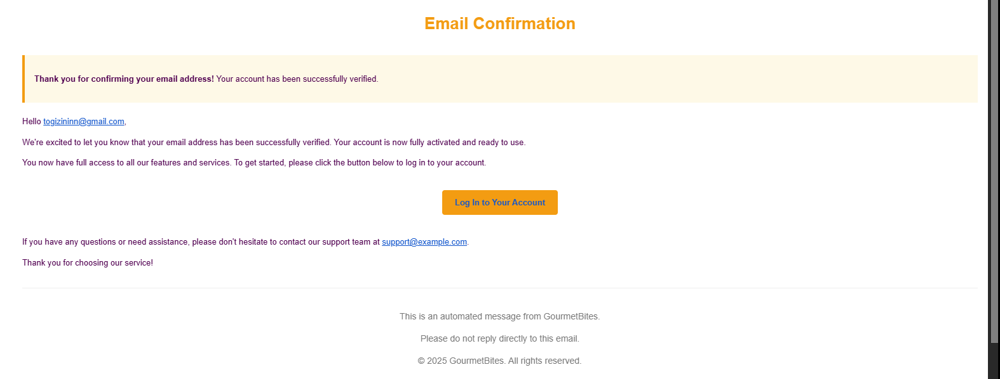
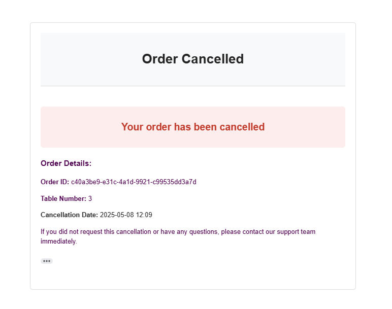
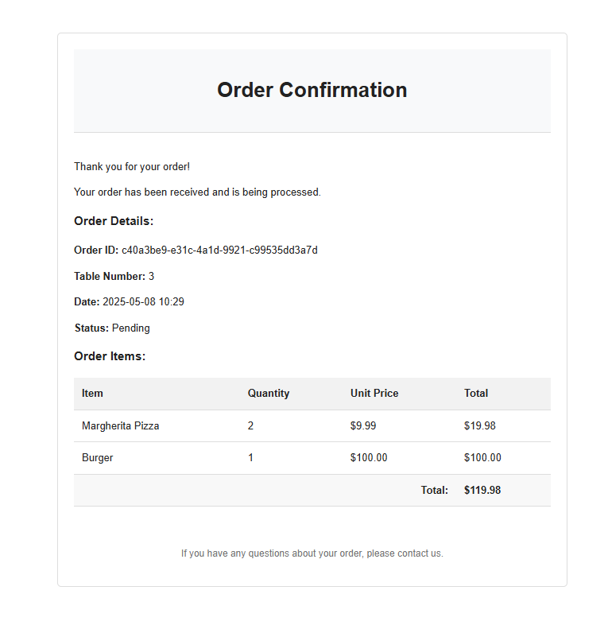
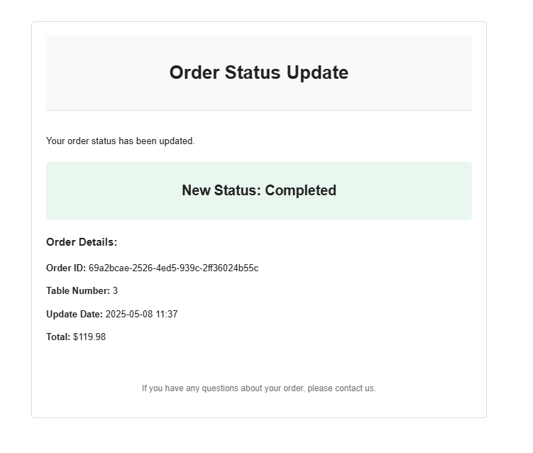

# 🍽️ Resto API

A comprehensive restaurant management system with features for authentication, inventory management, menu management, and order processing using .NET Core and CQRS with MediatR.

## 🌟 Overview

Resto API is a full-featured restaurant management system designed to streamline operations for restaurant businesses. The API provides functionalities for user authentication, inventory management, menu management, and order processing.

## ✨ Features

- **🔐 User Authentication & Authorization**: Register, login, email confirmation, password reset
- **📦 Inventory Management**: CRUD operations for ingredients
- **🍔 Menu Management**: Add, update, delete, and query menu items
- **📝 Order Processing**: Place, update, cancel, and track orders
- **📊 Event-Based Architecture**: Using MediatR for handling events and notifications
- **🧩 CQRS Pattern**: Clear separation of commands and queries
- **✅ Validation**: Request validation using Fluent Validation
- **🛡️ Exception Handling**: Global exception handling
- **🩺 Health Monitoring**: System health checks and monitoring

## 🏗️ Architecture

The Resto API follows a clean architecture pattern with:

- **🧠 Domain Layer**: Core business entities and rules
- **⚙️ Application Layer**: Business logic, commands, queries, DTOs
- **🔌 API Layer**: Controllers and request handling
- **🏢 Infrastructure Layer**: Data access, external services integration, email sending

Key architectural components:

1. **🔄 CQRS Pattern**: Clear separation of read and write operations using MediatR
2. **📢 Event-Driven Design**: MediatR for event publishing and handling
3. **💾 Repository Pattern**: Abstraction over data access

## 🛠️ Technology Stack

| Technology | Description |
|------------|-------------|
| **.NET 9.0** | Latest .NET framework with high performance |
| **MediatR** | Implementation of mediator pattern for CQRS and event handling |
| **Entity Framework Core** | ORM for data access with SQL Server provider |
| **Mapster** | Fast object-to-object mapping library |
| **FluentValidation** | Validation library with fluent interface |
| **Identity Framework** | Authentication and authorization framework |
| **JWT Bearer** | JWT token-based authentication |
| **MailKit** | Email sending capabilities |
| **AspNetCore.HealthChecks** | Health monitoring for services |
| **Scalar.AspNetCore** | Advanced API functionality |
| **Microsoft.AspNetCore.OpenApi** | OpenAPI specification and documentation |

## 🚀 Future Work

### 💰 Transaction Management
- Ensure data consistency across multiple operations

### 📣 Enhanced Notification System
- 📊 Low inventory alerts: Notify staff when ingredients are running low
- 👨‍🍳 Kitchen notifications: Immediate alerts to kitchen staff for new orders

### 🔑 Permission Enhancement
- Role-based access control refinement
- Fine-grained permission settings

### ⚡ Performance Optimization
- Redis caching implementation for high-performance data access
- Query optimization and database indexing strategy

## 📡 API Endpoints

### 🔐 Authentication

| Method | Endpoint                       | Description                              | Request Body                       |
|--------|--------------------------------|------------------------------------------|-----------------------------------|
| POST   | /api/Auth/register             | Register a new user                      | RegisterRequest                    |
| POST   | /api/Auth/login                | Login and get authentication token       | LoginRequestDto                    |
| POST   | /api/Auth/confirm-email        | Confirm user email                       | ConfirmEmailRequest                |
| POST   | /api/Auth/send-reset-password-code | Request password reset code           | Email (string)                     |
| POST   | /api/Auth/reset-password       | Reset user password                      | ResetPasswordRequest               |

### 📦 Inventory Management

| Method | Endpoint                       | Description                              | Request Body                       |
|--------|--------------------------------|------------------------------------------|-----------------------------------|
| GET    | /api/Inventory/ingredients     | Get all ingredients (paginated)          | pageNumber, pageSize (query params)|
| GET    | /api/Inventory/ingredients/{id}| Get ingredient by ID                     | -                                 |
| POST   | /api/Inventory/ingredients     | Create a new ingredient                  | CreateIngredientCommand           |
| PUT    | /api/Inventory/ingredients/{id}| Update an existing ingredient            | UpdateIngredientCommand           |
| DELETE | /api/Inventory/ingredients/{id}| Delete an ingredient                     | -                                 |

### 🍔 Menu Management

| Method | Endpoint                       | Description                              | Request Body                       |
|--------|--------------------------------|------------------------------------------|-----------------------------------|
| GET    | /api/Menu                      | Get all menu items (paginated)           | pageNumber, pageSize (query params)|
| GET    | /api/Menu/category/{category}  | Get menu items by category               | -                                 |
| POST   | /api/Menu                      | Add a new menu item                      | AddMenuItemCommand                |
| PUT    | /api/Menu/{id}                 | Update an existing menu item             | UpdateMenuItemCommand             |
| DELETE | /api/Menu/{id}                 | Delete a menu item                       | -                                 |

### 📝 Order Management

| Method | Endpoint                       | Description                              | Request Body                       |
|--------|--------------------------------|------------------------------------------|-----------------------------------|
| POST   | /api/Order                     | Place a new order                        | PlaceOrderCommand                 |
| PUT    | /api/Order/{orderId}/status    | Update order status                      | OrderStatusUpdateRequest          |
| DELETE | /api/Order/{orderId}           | Cancel an order                          | -                                 |
| GET    | /api/Order/{orderId}           | Get order details by ID                  | -                                 |
| GET    | /api/Order/customer/{customerId}| Get orders by customer                   | -                                 |
| GET    | /api/Order/pending             | Get all pending orders                   | -                                 |

### 📧 Email Screenshots

*Email Confirmation Template*

*Order Confirmation Email Template*

*Order Status Change Email Template*

*Order Cancellation Email Template*

## 🚀 Postman Documentation

